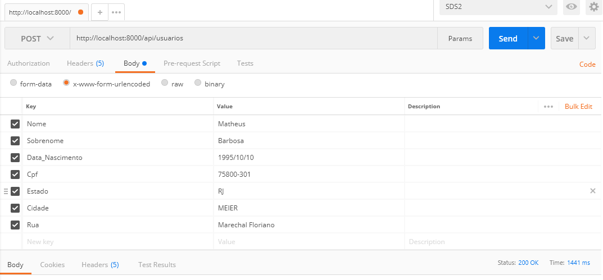

## Startando o projeto

1) Use o comando <strong>composer install</strong> para baixar as dependencias do projeto.
2) Use o comando <strong>php artisan migrate:fresh</strong> para criar a base de dados.

## Fazendo as requisições

 -Utilizei o postman para as requisiçoes

## API Usuario

  GET - Retornar todos os usuarios: http://SEUDOMINIO/api/usuarios

  GET - Retornar um usuario especifico: http://SEUDOMINIO/api/usuarios/{idDesejado}

  POST - Adicionar usuario e endereço do usuario ao banco de dados http://SEUDOMINIO/api/usuarios
    Exemplo: </img>

  PUT - Modificar usuario e endereço do usuario ao banco de dados http://SEUDOMINIO/api/usuarios/{idDesejado}

  DELETE - Excluir um usuario especifico http://SEUDOMINIO/api/usuarios/{idDesejado}

  Observação:Se você excluir um usuario,todos os endereços atrelhados a ele também serão excluidos.
## API ENDERECO

  DELETE - Excluir um endereco especifico http://SEUDOMINIO/api/enderecos/{idDesejado}

  PUT - Modificar Endereco do usuario ao banco de dados http://SEUDOMINIO/api/enderecos/{idDesejado}

  GET - Retorna todas as cidades cadastradas http://SEUDOMINIO/api/cidades/

  GET - Retorna uma cidade especifica http://SEUDOMINIO/api/cidades/{idDesejado}

  GET - Retorna todos os estados cadastrados http://SEUDOMINIO/api/estados/

  GET - Retorna um Estado especifico http://SEUDOMINIO/api/estados/{idDesejado}

  GET - Retorna o total de usuários cadastrados por cidade ou estado as cidades cadastradas 
  http://SEUDOMINIO/api/totalUsersByCityOrState/{param1}/{param2}/

    exemplo: param1 = Estado Ou Cidade 
             param 2 = Rj ou Guadalupe